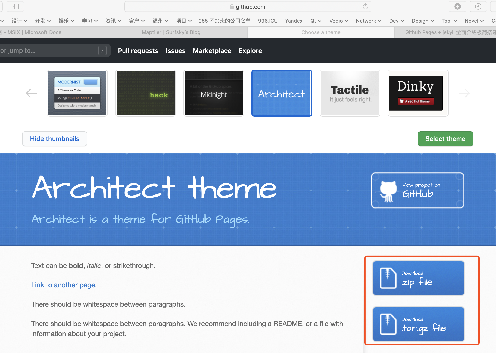
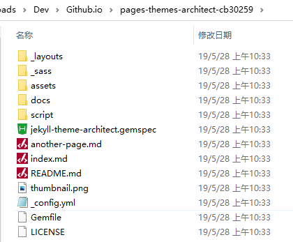

# 用 GitHub Pages 创建个人博客

## 参考

> https://zhuanlan.zhihu.com/p/51240503
> https://blog.csdn.net/kkwant/article/details/81001120


## 1. 基础步骤

- 在Github上创建库，名称如：githubUserName.github.io。
- 进入设置页面，设置其为 Github pages，并设置主题。
- 下载库，创建目录 _posts，并在里面创建md文件，文件名格式如：yyyy-mm-dd-title.md
- 修改 readme.md 文件（将展示为首页）
    ```
    ---
    layout: default
    title: Blog
    ---
    <h1>Latest Posts</h1>
    <ul>
      
        <li>
          <h2><a href="{{ post.url }}">{{ post.title }}</a></h2>
          <p>{{ post.excerpt }}</p>
        </li>
      
    </ul>
    ```
- 提交并Push。
- OK，可以在 https://githubUserName.github.io 上看到你的博客了。

## 2. 网页路径匹配规则

网页路径匹配规则如下

- 优先级别：index.html > index.md > readme.md
- title.md 映射为 /title
- /_posts/yyyy-mm-dd-title.md  映射为 /yyyy/mm-dd/title


## 3. 扩展

如果对网站的布局和样式不满意，可参照以下方法调整网站

- 在样式选择页面，下载样式网站，解压到你的库。
    
- 其主要内容如下
    
    - /_layouts    布局
    - /_sass       样式
    - /assets      资源
    - /docs        文档
    - /script      脚本
    - _config.yml  配置
    - index.md     首页
- 若有需要，可在_config.yml 中自定义参数
    ```
    title: Architect theme
    description: Architect is a theme for GitHub Pages.
    show_downloads: true
    google_analytics:
    theme: jekyll-theme-architect
    ```
- 修改_layout/default.html 布局文件。其语法可参考**编程参考**。
- 提交到Github测试效果。


## 4. 编程参考

以下为 GitHub Pages 的基础编码参考。
主要分为 _变量_ 和 _模板语法_ 两大块。
详细文档请参考官方文档：

### 4.1 网站变量

此类变量可在_config.yml中定义

- site.lang
- site.title
- site.description

## 4.2 Github变量

此类变量描述了相关联的 github 项目的信息

    - site.github.repository_name
    - site.github.repository_url
    - site.github.project_tagline
    - site.github.owner_url
    - site.github.build_revision
    - site.github.zip_url
    - site.github.tar_url

## 4.3 文档变量

此类变量描述了 .md 文件的头部信息

    - page.title
    - page.date
    - page.author

对应的md文件顶部如下

    ---
    title: Blog
    author: ABC
    date: 2020-01-01
    ---


### 4.3 帖子变量

_posts 目录下的md文件列表将被解析为 
    ```
    site.posts
    ```

其属性包括

    - post.url      帖子地址
    - post.title    帖子标题
    - post.excerpt  帖子首段落文本


## 4.4 模板语法

模板内容变量

``` html
    {{ content }}
```

变量引用

``` html
    {{ site.github.zip_url }}
```


条件判断

``` html

    .zip file

```

遍历

``` html

    <h2><a href="{{ post.url }}">{{ post.title }}</a></h2>
    <p>{{ post.excerpt }}</p>

```

## 4.5 示例

``` html

<!DOCTYPE html>
<html lang="{{ site.lang | default: "en-US" }}">
  <head>
    <meta charset='utf-8'>
    <meta http-equiv="X-UA-Compatible" content="IE=edge">
    <meta name="viewport" content="width=device-width, initial-scale=1, maximum-scale=1">
    <link rel="stylesheet" href="{{ '/assets/css/style.css?v=' | append: site.github.build_revision | relative_url }}" media="screen" type="text/css">
    <link rel="stylesheet" href="{{ '/assets/css/print.css' | relative_url }}" media="print" type="text/css">

    <!--[if lt IE 9]>
    <script src="https://oss.maxcdn.com/html5shiv/3.7.3/html5shiv.min.js"></script>
    <![endif]-->


  </head>

  <body>
    <header>
      <div class="inner">
        <a href="{{ '/' | absolute_url }}">
          <h1>{{ site.title | default: site.github.repository_name }}</h1>
        </a>
        <h2>{{ site.description | default: site.github.project_tagline }}</h2>
        
          <a href="{{ site.github.repository_url }}" class="button"><small>View project on</small> GitHub</a>
        
        
          <a href="{{ site.github.owner_url }}" class="button"><small>Follow me on</small> GitHub</a>
        
      </div>
    </header>

    <div id="content-wrapper">
      <div class="inner clearfix">
        <section id="main-content">
          {{ content }}
        </section>

        <aside id="sidebar">
          
            <a href="{{ site.github.zip_url }}" class="button">
              <small>Download</small>
              .zip file
            </a>
            <a href="{{ site.github.tar_url }}" class="button">
              <small>Download</small>
              .tar.gz file
            </a>
          

          
            <p class="repo-owner"><a href="{{ site.github.repository_url }}">{{ site.github.repository_name }}</a> is maintained by <a href="{{ site.github.owner_url }}">{{ site.github.owner_name }}</a>.</p>
          

          <p>This page was generated by <a href="https://pages.github.com">GitHub Pages</a>.</p>
        </aside>
      </div>
    </div>

    
      <script>
        (function(i,s,o,g,r,a,m){i['GoogleAnalyticsObject']=r;i[r]=i[r]||function(){
        (i[r].q=i[r].q||[]).push(arguments)},i[r].l=1*new Date();a=s.createElement(o),
        m=s.getElementsByTagName(o)[0];a.async=1;a.src=g;m.parentNode.insertBefore(a,m)
        })(window,document,'script','//www.google-analytics.com/analytics.js','ga');
        ga('create', '{{ site.google_analytics }}', 'auto');
        ga('send', 'pageview');
      </script>
    
  </body>
</html>


```